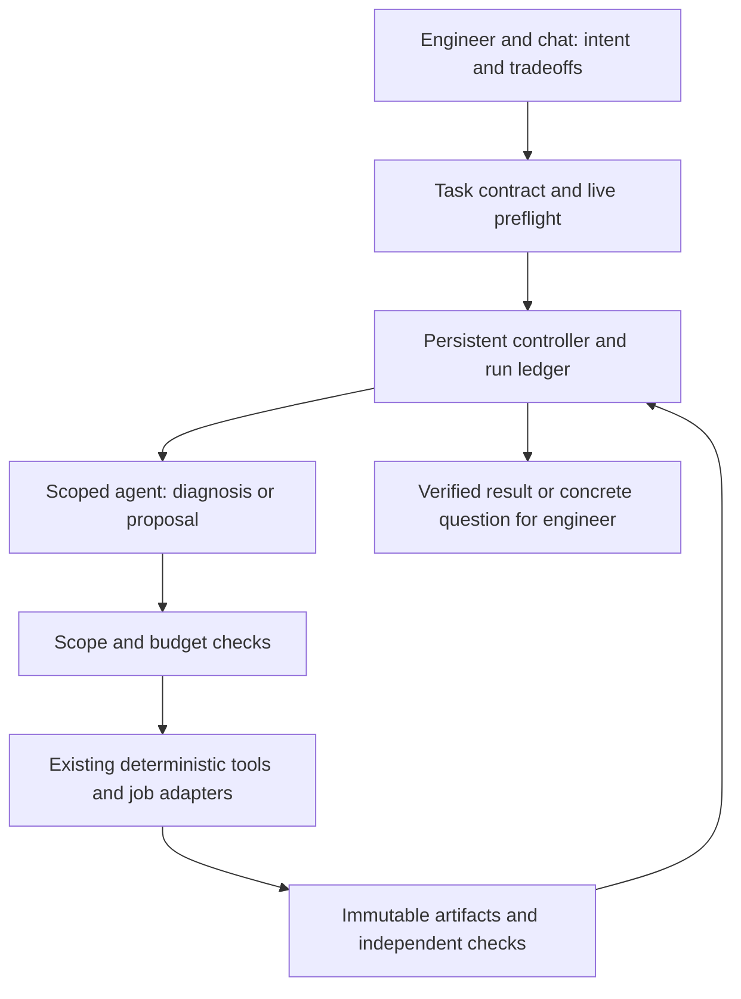

<!--docmeta
title: Agentic workflows versus chat-based engineering in spec2si
genre: study
status: active
area: top
owner: soumyajit
updated: 2026-09-16
summary: Task-by-task assessment of the incremental benefits of persistent agent workflows over tool-enabled chat, grounded in the spec2si repositories, with research evidence, tool options, evaluation criteria and concrete recommendations.
-->

# Agentic workflows versus chat-based engineering in spec2si

Research snapshot: **16 September 2026**. This is a comparative study and proposed adoption plan, not a report of a deployed agent pilot. Repository observations, published results and engineering judgments are distinguished below. No EDA jobs were launched for this study.

## 1. The question and the recommendation

**Where would a persistent agent workflow produce better engineering outcomes than the current chat-based approach, and what would have to change to earn that benefit?**

The baseline is a capable, tool-enabled chat session: an engineer discusses a problem with an AI, the AI reads repositories, edits code, runs commands and interprets results, and the engineer supplies direction or intervenes when needed. This is already agentic within a session. Describing the change as moving from an advisor to an executor understates the current approach and overstates the proposed benefit.

The incremental opportunity is **persistent orchestration across sessions, tools, machines and waits**: explicit task state; automatic continuation when an EDA job finishes; bounded repair cycles; reusable acceptance criteria; consistent evidence capture; and isolated concurrent experiments. None of these makes the model intrinsically better at circuit design. They can make its work more continuous, reproducible and economical.

**Recommendation: retain chat as the interface for intent, tradeoffs and novel diagnosis; introduce bounded autonomous workflows for repeated, objectively scored execution.** Start with failure triage/job continuation and cross-repository maintenance. Then pilot known-class DRC repair and constrained experiment campaigns. Keep topology exploration, specification ambiguity, first-time PDK interpretation and final signoff decisions closely supervised.

Three distinctions determine whether investment is justified:

- **Better than current chat:** does the workflow remove actual engineer handoffs, repeated context reconstruction or missed execution steps?
- **Better than ordinary automation:** does it need reasoning about variable observations, or would a script, job event handler or numerical optimizer suffice?
- **Better overall:** do those savings exceed implementation, review, incorrect-action recovery, model and licensed-tool costs?

The most credible benefit is fewer engineer interventions and avoidable tool runs, not an assumed improvement in raw model reasoning or a promised end-to-end design speedup.

## 2. Define the alternatives fairly

| Mode | Who controls the next step? | Strength | Limitation |
|---|---|---|---|
| Current tool-enabled chat | Engineer sets direction; AI can execute many steps within a session | Fast setup, rich discussion, flexible diagnosis, immediate human judgment | Continuity and provenance depend on session practices and handoffs |
| Chat plus better deterministic tooling | Engineer/chat invokes scripts with reliable jobs, manifests and checks | Often captures most operational savings cheaply | Novel branches and recovery decisions still return to the engineer |
| Bounded persistent agent | Controller resumes a worker within a predefined scope and budget | Repeated observe–decide–execute cycles can proceed unattended | Requires dependable observations, acceptance checks and recovery semantics |
| Multi-agent workflow | Controller delegates isolated tasks and integrates artifacts | Can parallelize independent work or separate specialist contexts | Coordination, duplicated effort, shared-resource contention and conflicting edits |

A chat tool that already supports long-running sessions, job wakeups or isolated workers may implement parts of the third mode. The comparison should therefore be between **workflow capabilities**, not interfaces or product labels. An unattended script is not necessarily an agent, and a conversation is not necessarily passive.

### A concrete counterfactual

Consider a layout change that requires three licensed verification cycles. In chat, the model can already generate the patch, launch verification and interpret the report. If the engineer must return after every job, reload the correct artifacts and prompt continuation, a persistent workflow can remove those handoffs. If the session already waits and resumes reliably, the incremental advantage is mainly standardized gates, restart recovery and evidence packaging.

If each failure has a known deterministic repair, a conventional repair script is the stronger baseline. If the results require unanticipated physical reasoning, autonomous continuation may save waiting time while increasing the chance of wasted iterations. The appropriate experiment must count both effects.

## 3. What the repository evidence changes

### 3.1 Inspection scope

The inspected local HEADs were flowkit `8b9a34b`, tsmc65 `d563d9ec`, tsmc28 `81d8262`, XT011 `7bccadd`, and SKY130 `5c60969`. These are checkout identifiers, not frozen experiment manifests: working-tree changes were also present. In particular, the flowkit memory plan and `runlog/` and `knowledge/` work were locally available but untracked. They must not be treated as released dependencies.

Private-port paths below are evidence locators for internal readers. This report does not reproduce PDK values, decks, layouts or private transcripts. It does not independently revalidate historical silicon or signoff claims.

| Inspected evidence | Implication for chat versus agent workflows |
|---|---|
| [Flowkit sharing contract](../README.md), [ADR-0002](decisions/0002-routekit-vendored-core.md), `sync.py` | Drift detection and propagation already have deterministic machinery. An agent adds diagnosis, affected-test selection and coordination; it should not recreate copying or treat intentional engine differences as drift |
| [Core policy](../policy/flow_policy.core.json), [conformance checker](../conformance/test_policy_conformance.py) | A passing conformance check can include `partial`, `not-implemented` and justified `waived` rules. A persistent agent needs a separate task-readiness/acceptance profile; blindly continuing after conformance would be unsafe |
| [DRC loop guide](drc_loop.md), [ADR-0003](decisions/0003-drc-in-the-loop.md), [loop code](../drcloop/loop.py) | Marker parsing, named refusals, baseline deltas and stream-bound replies already encode important lessons. The incremental agent role is choosing and coordinating experiments, not regenerating known geometry mathematics |
| [Electrical primitives](../routekit/elec.py), [IR solver](../irdrop/solver.py) | Numeric calculations belong in the existing code. Agent value is experiment planning and diagnosis; DC IR results alone cannot establish transient integrity or full reliability |
| tsmc65 `analog/regress/README.md`, `run.py` | A frozen offline task, reset checks and geometry-sensitive scoring are an excellent pilot foundation. The model-dependent driver remains manual; one route-plan task does not benchmark DRC/LVS/PEX or analog design |
| tsmc65 `deployment/bnl/jobs/README.md`, `cli.py`, `remote.py` | Job identity, status, wait/why/verify, license admission and `KNOWN/UNKNOWN/STALE` handling already exist. Much of the operational benefit can come from using this layer consistently in chat before adding autonomous reasoning |
| `docs/agent_memory_plan.md`, local `runlog/phase0.py`, `knowledge/themes.py` | The proposed remedy is scoped lessons, verified restore state and measured error causes. Both chat and unattended workers can benefit; memory is not an exclusive advantage of autonomous agents |
| tsmc28 `dig_flows/README_physical_signoff.md` | Collateral, streaming and pin-orientation errors can masquerade as design failures. Classifying these before another expensive run is a promising reasoning task in either mode |
| SKY130 `README.md` | Current local documentation records analog closure vehicles and a digital block reaching physical signoff. The older flowkit overview's infrastructure-only characterization is stale; capability must be established per task rather than inferred from an old port label |

The core's stdlib-only design and old cluster Python floor are deliberate. A modern agent framework should run in a separate workstation/service environment and exchange JSON with thin cluster adapters. Adding a framework dependency to every vendored consumer would impose cost on work that needs no agent at all.

### 3.2 Important corrections to the original report

1. **`--score-only` is not verification of a proposed layout.** In tsmc65 `analog/engine/layout/ruleprobe_run.py` it re-scores an existing `DRC.rep` without a license. A geometry change requires fresh deck execution and a fresh reply.
2. **The shared DRC responder is scoped.** The minimum-area responder exists; arbitrary width, spacing, density and LVS repairs are not supplied by `drcloop`. Autonomous repair must begin with supported cases.
3. **No generic `verify_layout` queue was established.** Process-specific verification functions and a separate job layer exist. A uniform typed interface is integration work, not an API already available everywhere.
4. **Memory does not require a vector database.** The existing plan explicitly starts with deterministic scope selection, compact lessons and verified live state.
5. **Electrical widening is producer-side.** The electrical code selects widths for the next width-aware route solve. Rewriting drawn rectangles afterward would bypass the intended contract.
6. **Vendor agents do not automatically understand this PDK configuration.** Published product scope is not proof of access, supported APIs, qualified decks or compatibility with the installed flow.

## 4. Task-by-task incremental benefit

The ratings below are engineering judgments to test, not measured outcomes. “High” means a strong reason to pilot, conditional on a usable acceptance oracle.

### 4.1 Failure triage, job continuation and environment recovery — high

**Current chat:** strong at interpreting logs and testing hypotheses, but the engineer may need to resume a session, locate the right report, explain what ran, or distinguish a stalled job from a lost connection.

**Added benefit:** automatic wakeup on job completion; reconstruction from the job/artifact manifest; classification of license, transport, stale-output, collateral and actual design failures; a bounded next diagnostic experiment; a review packet when human judgment is required. Overnight execution can reduce elapsed turnaround even if the model's diagnosis is unchanged.

**What a script can already do:** wait for completion, retry a transient connection, verify hashes, identify known exit codes and missing reports. Implement these without an LLM. Invoke reasoning only for variable or ambiguous failures.

**Limits:** retrying a design failure as if it were infrastructure can burn licenses. A lost connection must not trigger duplicate submission. Some apparent tool failures actually reflect invalid engineering assumptions.

**Pilot / measure:** replay stale-output, truncated-report and transport-after-submit cases using the existing job layer. Measure engineer interventions, time from job completion to the next useful action, duplicate submissions and correct diagnosis against an independently reviewed answer.

### 4.2 Cross-repository maintenance and policy propagation — high

**Current chat:** an engineer asks for a core fix, the AI edits it, vendors it and checks consumers. This already works for occasional changes.

**Added benefit:** repeatable detection-to-review workflow after an approved trigger; consistent consumer coverage; automatic preparation of coordinated patches and a compatibility manifest. The benefit grows with repeated changes and multiple ports.

**What a script can already do:** `sync.py --check-all`, exact vendoring and fixed test execution. Agent reasoning is useful for why a consumer failed, where a fix belongs and whether divergence is intentional.

**Limits:** an overzealous agent can “repair” real process differences, edit vendored files directly or change policy status to make checks pass. Multi-repo merges are not atomic.

**Pilot / measure:** a small core change with one intentionally failing consumer. Compare total review time, omitted consumers, inappropriate local edits and accepted patches. Start with preparing reviewable changes, not automatic merge.

### 4.3 Known-class DRC repair — medium to high; novel repair — low initially

**Current chat:** the model reads findings, relates them to layout and iterates with the engineer. Human inspection is especially valuable when ownership or rule semantics are unclear.

**Added benefit:** supported parse–patch–restream–DRC cycles can proceed under a fixed budget without repeated prompts. Every patch can be bound to the stream it answered, and every iteration can preserve evidence automatically.

**What a script can already do:** the minimum-area response and many known class-specific actions. If all decisions are determined by rule class, finish the deterministic loop first. An agent earns its place by handling refusals, selecting a useful isolation experiment or diagnosing why the expected response failed.

**Limits:** reducing total markers can hide a new short or an exchanged violation. The wrong top, layer purpose or coordinate frame invalidates a plausible geometric repair. DRC improvement alone does not imply LVS or electrical preservation.

**Pilot / measure:** one proven eligible class in a port with replayable fixtures, including a repairable case and named refusals. Compare chat, deterministic loop and agent-assisted loop on independently accepted fixes, licensed runs and engineer minutes. Keep unsupported repair-class development in supervised chat until it has its own tests.

### 4.4 Digital RTL and verification — medium to high for regressions

**Current chat:** excellent for discussing interface behavior, generating RTL/tests and debugging a counterexample. The engineer can resolve specification ambiguity immediately.

**Added benefit:** unattended regression triage, counterexample minimization, bounded patch-and-retest cycles and consistent requirement-to-test tracking. Independent blocks or test campaigns may run concurrently.

**What a script can already do:** compile, lint, run fixed regressions and collect coverage. The reasoning benefit is interpreting an unexpected failure or generating a discriminating test.

**Limits:** a worker can write a design and a testbench that share the same misunderstanding. Coverage growth is not functional correctness; changed latency, reset assumptions or timing exceptions can create false progress.

**Pilot / measure:** freeze the behavioral contract and independent tests, then assign a historical bug. Score against held-out properties and a deliberately incorrect variant. Record functional acceptance before PPA. Leave ambiguous protocols and architectural tradeoffs in chat.

### 4.5 Analog sizing and design-space exploration — medium, conditional

**Current chat:** the engineer and model interpret gain, bandwidth, noise, stability and power tradeoffs, then launch sweeps. Interactive discussion is valuable when objectives conflict or the topology is questionable.

**Added benefit:** persistent multi-corner campaigns, adaptive experiment selection, systematic tracking of infeasible trials and automatic promotion of finalists to extraction/post-layout evaluation. The agent can identify that the current search bounds or model assumptions are the problem and propose a changed experiment.

**What an optimizer can already do:** select numeric trials in a fixed parameter space, enforce defined feasibility and report a Pareto set. Compare against this baseline; an LLM choosing every transistor dimension can be slower and less reproducible.

**Limits:** optimizing a nominal metric can sacrifice worst-case margin or yield. Failed convergence is not a good objective value. Topology changes invalidate assumptions and can dramatically expand the required verification.

**Pilot / measure:** freeze topology and parameter bounds, use the same simulator budget for optimizer-only and agent-assisted search, and independently validate finalists across the declared conditions. Measure feasible improvement per simulation and engineer time, not just the best nominal point.

### 4.6 Routing, EM–IR and physical tuning — medium

**Current chat:** useful for explaining congestion, selecting width/rail strategies and interpreting electrical limits.

**Added benefit:** coordinate the sequence of route generation, fast screening, extraction and electrical checks; detect stagnation and choose the next allowed parameter change. Independent candidates can be evaluated without the engineer managing each run.

**What deterministic tools already do:** resistance/width calculations, DC IR solving, routing and fixed parameter search. An agent should call these tools, not replace their calculations.

**Limits:** changes that improve resistance can worsen congestion, capacitance or another constraint. A DC estimate is a screening result. Full signoff obligations remain process- and design-specific.

**Pilot / measure:** constrain allowed parameters, feed widths into the routing producer, and compare feasible quality vectors under a common run budget. Count license occupancy across all parallel candidates.

### 4.7 PDK porting and capability bring-up — medium for organization, low for autonomous interpretation

**Current chat:** the engineer can resolve unfamiliar rule semantics, documentation ambiguity and tool-version behavior in a tight discussion loop.

**Added benefit:** maintain a capability/gap matrix, generate minimal probes, execute clean/violating pairs and record evidence consistently. Repetitive adapter scaffolding can be delegated.

**What scripts can do:** schema validation and probe execution once the expected behavior is known. The hard judgment is identifying what must be measured and what the evidence actually means.

**Limits:** an inferred rule value or a false equivalence between foundry options can contaminate many downstream results. Another SKY130 flow does not establish compatibility with this port's collateral.

**Pilot / measure:** one adapter and a reviewed probe plan. Require both expected rejection and expected acceptance. Keep unresolved process facts explicitly unknown and return interpretation decisions to chat.

### 4.8 Novel architecture, topology and mixed-signal integration — chat remains the default

These tasks often lack a stable objective, executable oracle or agreed decomposition. Human context about system goals, acceptable tradeoffs and implementation intent is central. A persistent agent can collect evidence, run an agreed experiment matrix and audit interfaces, but extended unattended reasoning can optimize the wrong problem.

Use chat to agree on the architecture and decision criteria, then dispatch bounded evidence-gathering tasks. For mixed-signal integration, make power, clock, reset, signal-range and abstraction assumptions explicit. Faster block completion does not establish correct interfaces or chip-level closure.

### 4.9 Memory, documentation and signoff packaging — useful in both modes

Scoped lessons, verified restore manifests and automatic evidence bundles reduce repeated explanations and handoff mistakes in chat as well as unattended workflows. They should be shared infrastructure, not claimed as benefits exclusive to agentification.

An agent can propose a lesson or summarize signoff coverage; deterministic code should check provenance and required artifacts. A human or authorized release process owns promotion and final disposition of exceptions. A persuasive signoff summary is not a signoff result.

### 4.10 Recommended division of labor

| Task | Default mode | What to automate first |
|---|---|---|
| Novel design intent and tradeoffs | Chat | Evidence retrieval and experiment setup |
| Routine job waiting/status/recovery | Deterministic tooling | Event-driven continuation, identity checks, transient retry |
| Ambiguous failure triage | Bounded agent, escalate when needed | Structured observations and one discriminating experiment |
| Vendoring and routine checks | Deterministic tooling + bounded diagnosis | Full consumer coverage and review packaging |
| Supported DRC response | Deterministic loop + bounded agent for exceptions | Freshness, replay, refusal handling and complete rechecks |
| New DRC repair algorithm | Supervised chat | Fixtures and negative controls before unattended use |
| RTL regression repair | Bounded agent | Independent oracles and patch/retest budget |
| Fixed numeric search | Optimizer | Feasibility, corner coverage and experiment bookkeeping |
| Search-space/topology revision | Chat or bounded proposal | Concrete alternatives and validation plan |
| Final acceptance and release | Deterministic gates + authorized review | Complete artifact-bound evidence bundle |

## 5. What published evidence supports—and does not

| Primary source | Reported evidence | Relevance and limit |
|---|---|---|
| [ASIC-Agent, Allam et al., 2025](https://arxiv.org/abs/2508.15940) | Specialized agents, retrieval and tool execution for RTL, verification, OpenLane hardening and Caravel integration | Supports the feasibility of coordinated digital tasks. Does not establish an advantage over this project's tool-enabled chat or reliability on its custom analog engines |
| [CVDP, Pinckney et al., 2025](https://arxiv.org/abs/2506.14074) | 783 problems across 13 categories; evaluated models achieved at most 34% pass@1 on code generation; reuse and verification were difficult | Supports diverse independent testing. This is a historical result for that setup, not a current model ranking or a predicted spec2si success rate |
| [AMS-IO-Agent, Zhang et al., 2025 / AAAI 2026](https://arxiv.org/abs/2512.21613) | Structured knowledge and JSON/Python intermediates for wirebond I/O-ring generation; over 70% DRC+LVS pass rate and a reported fabricated 28 nm example | Supports constrained AMS subtasks with structured inputs. Does not establish general analog sizing or arbitrary layout closure |
| [Can AI Agents Really Complete RTL-to-GDS?, Deng et al., July 2026](https://arxiv.org/abs/2607.17528) | Commercial-tool PicoRV32 study with three architectures and four models; interface mismatches and substantial cost-efficiency differences despite similar progress | Supports process-level evaluation, stable adapters and cost accounting. One design and two timing targets do not establish universal superiority |

These are authors' reported results, not independent reproductions performed for this report. Taken together, they support constrained scope, structured intermediates and executable feedback. They do **not** provide a controlled estimate of how much better persistent orchestration will be than the existing spec2si chat workflow. That must be measured locally.

### Vendor offerings

**Cadence ChipStack** was announced in February 2026 for front-end design and verification, including design/testbench coding, test planning, regression orchestration and debugging. It is a candidate for the digital verification lane; its launch material does not establish a general custom-analog DRC-repair API. Productivity multipliers are vendor claims, not results on these repositories. [Cadence announcement](https://www.cadence.com/en_US/home/company/newsroom/press-releases/pr/2026/cadence-unleashes-chipstack-ai-super-agent-pioneering-a-new.html).

**Synopsys AgentEngineer** has a broader published scope: the July 2026 announcement describes long-running verification and multi-step analog workflows spanning creation, SPICE, implementation and verification. A narrowly scoped trial is worth considering, but published scope does not establish entitlement, a supported public adapter API or compatibility with spec2si's mixed-vendor tools. [Synopsys announcement](https://news.synopsys.com/2026-07-26-Synopsys-Showcases-Comprehensive-Autonomous-Engineering-Workflows-from-Silicon-to-Systems,-Developed-with-NVIDIA-Technology).

Evaluate either on a held-out task using actual installed tool versions, exportable artifacts, independently rerun checks and measured license consumption. Ask for batch integration, restart behavior, supported data boundaries and commercial access before investing in an adapter. Neither product is a reason to replace a working process engine on the strength of a demonstration.

## 6. The minimum architecture needed to realize the benefits

The workflow must preserve the advantages of chat: the engineer can inspect current state, change direction explicitly and resume a blocked task. Autonomy should remove routine handoffs, not make the system opaque.



### 6.1 Task contract and independent acceptance

Define a task before launching it: exact input manifest, intended outcome, editable paths, protected checkers/decks/specification, allowed experiments, required acceptance gates, budget and escalation conditions. The controller—not the model's final message—decides whether the evidence satisfies that contract.

For a DRC pilot, an initial budget might be three candidate revisions, six expensive stage submissions, four elapsed hours and one concurrent licensed job, plus a model-cost ceiling. These are **illustrative caps**, not measured requirements. Count baseline and final checks against them. Reject or resize a task up front if its required verification cannot fit. License waiting, model time, active tool time and seat-hours need separate accounting.

Input manifests should bind the source commit and dirty patch, design specification, relevant libraries, PDK/metal-option profile, tool/deck configuration, top cell, corners, scripts, artifact hashes, briefing and acceptance-profile version. A hash proves identity, not correctness. Keep process-sensitive manifests private.

Protect the acceptance oracle outside the editable workspace. A worker that changes the test, a waiver, the timing constraint or the spec to obtain PASS has changed the task. Such changes require an explicit decision with their consequences visible.

### 6.2 Adopt the existing cluster-job system; extend only the missing contracts

**The primary gap is default AI-tool behavior: the machinery exists, but the tool does not consistently use it unless reminded.** This user-reported failure is distinct from incomplete launcher migration. The `deployment/bnl/jobs/` system already exists in the tsmc65 and tsmc28 checkouts. Its tsmc65 README records completed implementation and historical live validation, and source inspection confirms the interfaces below. There is no reason to build a second submission, polling, event or artifact-tracking service for agents.

The remedy must operate at the assistant's execution boundary: load the cluster workflow at session startup/resume, route relevant launches through the tracker by default, retain job IDs automatically, and use tracker status/events/verification before interpreting results. A pre-execution guard should catch known bypasses and direct the assistant to the supported launch path without requiring a user reminder. Instructions alone are not a reliable default. Keep read-only diagnostics available and make launch exceptions explicit and recorded. Apply the same behavior to current chat before claiming a benefit from autonomous orchestration.

| Capability already implemented | Existing interface / record | Reuse in both chat and agent workflows |
|---|---|---|
| Detached submission and unique job identity | `jobs run`, `Transport.run(argv, ...)`, cluster-side `runjob` | Capture the returned job ID; retain its isolated stdout and lifecycle records |
| Status, progress and diagnostics | `jobs ls/watch/why`; `Transport.list/status/why` | Read published state, heartbeat, progress and process diagnostics instead of reconstructing status from arbitrary shell commands |
| Completion notification | `jobs wait`; `Transport.events`; `events.jsonl` | Continue from existing terminal events; do not invent another completion detector |
| Artifact identity | Expected artifacts, hashes in `result.json`, `artifacts.sha256`, `jobs verify` / `Transport.verify` | Verify outputs through the existing records before interpreting them |
| In-process registration | `bin/jobrec.py`: attach to a parent or self-register | Reuse engine hooks rather than requiring every flow to acquire a new launcher |
| Progress and license observations | `progress.py`, `license.py`, published license state | Preserve existing progress/ETA and license-wait distinctions; qualify admission behavior per engine rather than assuming a universal scheduler |
| Robust remote transport | `remote.py`: structured envelopes and `KNOWN/UNKNOWN/STALE` | Keep failures and stale observations distinct from absent jobs or successful execution |

Source evidence: tsmc65 `deployment/bnl/jobs/README.md`, `remote.py`, `cli.py`, `bin/runjob`, `bin/jobrec.py` and `bin/report.sh`. The artifact browser in both tsmc65 and tsmc28 also reuses this transport. Availability is therefore broader than a proposed agent-only interface.

**Adoption is uneven in the inspected source.** Tsmc65 `dig_flows/run.py` wraps its stage loop in a recorder that can self-register. Its `analog/engine/spectre_flow.py` and `mixed_signal/flow/ams_flow.py` use attach-only simulation counters: without a tracked parent, those counters do not create a job. Several legacy launchers were migrated to `runjob`, including `analog/engine/sync/launch_final.sh`. In contrast, tsmc28 `analog/engine/char/adc_cal_bench.sh` still launches with `setsid nohup` and its own log/done files; XT011 `analog/bench/launch_buf_bench.sh` also implements its own detach/log path. These are concrete integration gaps, not evidence that the tracker needs replacement. A caller could wrap such scripts externally, so static inspection alone cannot quantify actual untracked usage.

There are also important **contract gaps for unattended acceptance**:

- Registration is intentionally best-effort: `jobrec.py` can silently disable itself on failure, and `ASICJOBS=0` disables recording. Require a confirmed job record before an unattended workflow treats execution as tracked; retain the existing permissive behavior for other users unless deliberately changed.
- `jobs verify` returns exit code **0 for `UNSTAMPED`** as well as for a successful check. Inspect the structured verdict and require the task's expected artifact set to be present and hashed. Exit zero, or a valid hash for only a subset of required outputs, is insufficient.
- Job `result.json` and flow `report.json` are distinct. Join them by job/input/output identity and require the flow's engineering checks; do not reinterpret job completion or artifact freshness as design acceptance.
- `Transport.run` takes command and progress/artifact options, but the inspected signature has no caller-supplied idempotency key. Lost-response reconciliation and task-to-job mapping remain specific extensions to verify/build, not features to assume.

If a common agent-facing API is useful, make it a thin wrapper over these interfaces. For example, proposed `submit_stage` validates a named stage and delegates to `Transport.run`; proposed `get_job/get_result` uses `status/why/verify`; the controller retains task intent, budget and the existing job IDs. Keep the tracker as the source of job lifecycle and artifact records. New work should concentrate on briefing selection, acceptance profiles, task-to-job linkage, required-artifact coverage and review packaging—not duplicate job infrastructure.

**Adoption-first action:** inventory the entry points used for pilot tasks; ensure each creates or attaches to a record, declares required artifacts, and uses `wait/why/verify` on completion. Measure tracked launches divided by all pilot launches, launches with complete expected-artifact hashes, and completion events actually consumed. Reconcile against launcher instrumentation or an independent process inventory: tracker records alone cannot count jobs that bypass it. This inspection did not query live cluster history, so it establishes source-level gaps, not a numerical usage rate.

Git worktrees isolate source edits but not OpenAccess libraries, simulator work areas or shared fixed-name reports. Allocate those per run as well. Use one writer or explicit locking where a vendor database cannot safely support concurrent edits.

### 6.3 Persistence, recovery and stopping

Persist workflow state independently of the conversation. Useful states include `PREFLIGHT`, `SUBMITTED`, `WAITING`, `VERIFYING`, `NEEDS_REVIEW`, `SUCCEEDED`, `FAILED`, `BLOCKED` and `CANCELLED`; transport freshness remains a separate property.

Record submission intent before dispatch. After a lost connection, reconcile a stable idempotency key with the remote record and attach to the existing job. A workflow engine alone does not guarantee exactly-once external EDA execution. An unreachable host is not proof that a job is absent.

Deterministically retry narrowly defined transient failures with capped backoff. Do not blindly retry unsupported rules or design failures. Suspend model activity during waits; wake on events or bounded polling. Cancellation must stop new submissions and report whether active jobs actually stopped.

Stop on budget exhaustion, repeated candidate hashes, recurring failure/patch cycles, missing required evidence, regression or an out-of-scope dependency. Preserve the best **verified** candidate separately from the latest one. Escalate with the exact blocker and evidence, rather than another broad request to “fix the design.”

### 6.4 Acceptance must preserve engineering meaning

`Ledger.clean` is a relative statement about no added count over a control. It is not zero violations, qualified waivers, LVS match or chip signoff. Equal per-rule counts can also conceal a new violation replacing an old one. Autonomous promotion should supplement counts with marker identity/location comparisons where supported and explicit handling of baseline exceptions.

Required gates are task-specific, but must cover:

- Correct design/top, fresh artifacts, complete reports and required corners.
- Structural/collateral checks and negative controls for critical detectors.
- Applicable fresh DRC/LVS and functional/formal/equivalence checks.
- Extraction, post-layout performance, timing or EM–IR checks affected by the change.
- Evidence binding, intended diff and visible residual exceptions before promotion.

Geometry changes invalidate dependent extraction/simulation artifacts. Process exit zero and schema-valid JSON cannot establish correctness. Missing, stale, unsupported and unexecuted checks stay non-passing. Block success does not discharge chip-level density, antenna, assembly, power and interface obligations.

### 6.5 Memory and disclosure boundaries

Adopt the existing memory plan's versioned scoped lessons, compact verified restore state and bounded briefing. Deliver the same briefing to chat and autonomous conditions when measuring orchestration benefit. Otherwise an apparent agent advantage may simply be better context.

The planned 24-attempt failure sample and 10–20 seed lessons are reasonable starting sizes, not evidence that classification or a production briefing pipeline is complete. Promote mechanically preventable lessons into gates. Add embeddings only if held-out retrieval tests show that deterministic scope selection misses relevant knowledge.

Local execution of an agent CLI does not imply local model inference. Apply the approved disclosure boundary to prompts, logs, traces, checkpoints, embeddings and support uploads. Removing deck text does not necessarily sanitize geometry, rule names or summaries. Keep private regression material and process facts out of public-core artifacts. A no-training setting alone does not establish permission to disclose foundry information.

Use server-side permissions, protected paths and constrained credentials. Treat tool output and retrieved documents as evidence, not authority to expand permissions. Routine reads, tests and budgeted experiments need no repeated human approval; changed requirements, waivers, scope, access or release decisions do.

## 7. Available tool options and how to choose

Tools are alternatives within different layers, not interchangeable products. A coding harness does not replace job control; an orchestrator does not replace verification; a numerical optimizer is not an agent framework.

### 7.1 Reasoning worker and controller

| Option | Relevant capability | Recommended use / tradeoff |
|---|---|---|
| [Codex CLI non-interactive mode](https://developers.openai.com/codex/noninteractive) and [Codex SDK](https://developers.openai.com/codex/sdk) | Scripted coding-agent execution, JSON events and schema-constrained final output; programmatic local sessions | First-pilot candidate for repository diagnosis/patching. Keep external job ownership and acceptance in the controller; structured model output remains a claim |
| [Claude Agent SDK](https://code.claude.com/docs/en/agent-sdk) | Programmable Claude Code loop, tools and context management in Python/TypeScript | Comparable first-pilot candidate, especially with existing Claude workflows. Configure tool permissions and measure automation billing and actual local outcomes |
| [OpenAI agent tooling](https://developers.openai.com/api/docs/guides/agents) | API/SDK surfaces for custom agent applications | Useful when a narrow domain tool loop is preferable to a general coding harness. More application behavior must be maintained locally |
| Plain Python controller + SQLite/JSON | Project-owned state machine, budget checks and local run records | Recommended smallest first implementation. Requires deliberate transaction/recovery design; use local disk and a single writer, not concurrent SQLite writes on shared NFS |
| [LangGraph persistence](https://docs.langchain.com/oss/python/langgraph/persistence) and [interrupts](https://docs.langchain.com/oss/python/langgraph/interrupts) | Persisted graph state and resumable human-input points | Add when branching and pause/resume logic become substantial. Resumed nodes can re-execute code, so side effects need idempotency |
| [Temporal](https://docs.temporal.io/) and [Activities](https://docs.temporal.io/activities) | Durable workflow execution and retryable external activities | Consider for a multi-user, multi-day operational service. Adds server/worker administration; external submissions still require reconciliation |
| [CrewAI Flows](https://docs.crewai.com/en/concepts/flows) | Event-driven flows, state and persistence | Viable if already familiar to the team; role-based agent descriptions alone are not an engineering advantage |
| [smolagents](https://huggingface.co/docs/smolagents/en/tutorials/secure_code_execution) | Lightweight agent implementation with documented execution-isolation options | Useful for contained experiments; generated-code execution still needs a real isolation boundary |

**Initial choice:** one coding harness behind a small project-owned contract. Compare Codex and Claude on the same frozen tasks rather than selecting by a general model leaderboard. Current Codex SDK documentation describes Python and TypeScript interfaces; the project need not adopt TypeScript. Pin the actual harness, model configuration and runtime for evaluation.

Avoid layering several autonomous loops merely to obtain an agent framework diagram. A separate modern runtime preserves the stdlib-only consumer path. Introduce LangGraph when explicit branching/interrupt handling would simplify maintenance; introduce Temporal when service recovery and concurrent operations justify its operational cost.

### 7.2 Tools for the work itself

| Need | Available option | Fit |
|---|---|---|
| Numeric analog exploration | Existing scripts; [Optuna multi-objective optimization](https://optuna.readthedocs.io/en/stable/tutorial/20_recipes/002_multi_objective.html) | Fixed parameter schema, hard feasibility and Pareto alternatives; agent revises hypotheses/search space rather than choosing every number |
| Open digital flow tuning | [OpenROAD AutoTuner with Ray](https://openroad-flow-scripts.readthedocs.io/en/latest/user/InstructionsForAutoTuner.html) | Useful for a compatible open-flow experiment and as prior art; not a drop-in driver for existing commercial ports |
| Open RTL property checking | [SymbiYosys](https://symbiyosys.readthedocs.io/en/latest/) | Compatible RTL/property tasks; bounded checking is not unbounded proof, and assumptions must be reviewed |
| Physical verification and extraction | Existing qualified Calibre/PVS/Pegasus and extraction wrappers | Preserve node-specific decks, parsers and configuration as acceptance authorities |
| Analog validation | Existing Spectre/post-layout flows | Fixed corner/model conditions and explicit convergence/completeness handling |
| Commercial agent trial | ChipStack for front-end verification; AgentEngineer for a supported demonstrated workflow | Evaluate exported artifacts with the same local oracle and resource budget; confirm access and integration first |

MCP can expose the same adapters to several clients, including chat. It is useful for interoperability, not a prerequisite for the pilot or an enforcement mechanism. MCP's own guidance distinguishes tool annotations from guarantees; authorization and validation must remain in the adapter. [MCP annotation guidance](https://blog.modelcontextprotocol.io/posts/2026-03-16-tool-annotations/).

If inference must remain on premises, evaluate a self-hosted model as another worker behind the contract. Do not assume equal reasoning quality or tool reliability; the same acceptance suite applies. Keep the choice of model host separate from where the controller and EDA tools execute.

## 8. Measure incremental benefit against the current approach

### 8.1 Use an ablation, not a before/after anecdote

Compare these conditions on frozen tasks:

| Condition | Purpose |
|---|---|
| A: current tool-enabled chat | Establish actual engineer effort, accepted outcomes and cost |
| B: chat with the same briefing, adapters, manifests and gates proposed for agents | Isolate the benefit of better infrastructure and context |
| C: bounded persistent worker using B's tools and the same model configuration | Measure the incremental benefit/cost of unattended orchestration |
| D: deterministic script or optimizer, where applicable | Test whether reasoning is necessary at all |

Add multi-agent condition E only after C works and there is independent work to parallelize. A versus C alone would incorrectly credit agent orchestration for improvements caused by better tools, memory or a stronger model.

Use 12–20 initial tasks spanning maintenance, environment/collateral diagnosis, stale artifacts, supported/refused DRC cases and a small digital/analog subset where oracles exist. Repeat stochastic conditions, for example three times within fixed budgets. Treat this as a pilot, report denominators and variation, and avoid a universal success percentage across unlike domains.

Keep model/harness versions, input state, budgets and permissible feedback fixed for paired comparisons. Randomize task order where practical to reduce human learning effects. Keep post-fix commits, reference answers and hidden tests inaccessible to workers; historical replay otherwise risks becoming answer retrieval. Record engineer interventions rather than letting informal rescue disappear from the results.

### 8.2 Metrics that answer the user's question

| Metric | What it reveals |
|---|---|
| Independently accepted tasks / all attempts | Whether automation completes useful work, including timeouts/refusals in the denominator |
| Human active minutes and intervention count | The principal expected advantage over chat |
| Time from tool completion to next useful action | Whether persistence removes waiting/handoff delays |
| Total elapsed time to reviewed acceptance | Includes queueing, retries and review, not only model generation |
| Licensed submissions and seat-hours | Whether autonomy saves scarce capacity or simply spends it unattended |
| Model/compute cost per accepted task | Counts failed attempts and excessive reasoning |
| False acceptance and missing-evidence escapes | Whether unattended execution hides engineering errors |
| Fixed-condition quality vector | Preserves PPA or analog margins rather than rewarding mere completion |
| Recovery and duplicate-submission rate | Tests the value of persistent state under actual interruptions |
| Engineer review/recovery effort | Detects work shifted from execution into harder auditing |

Suggested advancement criteria are zero observed false acceptances; all critical injected faults detected; no duplicate submission after restart; complete provenance for every accepted result; and at least 20% lower median human active time or avoidable licensed submissions versus **B**, without worse quality. These are proposed targets, not promised improvements. A small pilot with no observed escapes does not prove zero future risk.

Fault injections should include stale GDS, wrong top, truncated report, missing corner, changed deck identity, license exhaustion, connection loss after dispatch and attempted modification of a protected checker. Expected outcomes are refusal, named failure or safe reattachment—not an invented PASS.

### 8.3 Economics and the break-even decision

For a recurring task family, estimate:

`net benefit = avoided human effort + value of faster turnaround + avoided tool waste - added model/tool cost - review/recovery cost - amortized implementation/maintenance cost`

Use engineering hours and seat-hours if meaningful dollar valuations are unavailable. Count all unsuccessful trials and all parallel workers. A workflow that saves ten minutes on a rare task may not justify weeks of integration; one that removes repeated daily handoffs may. These values must come from the pilot, not a generic vendor productivity multiplier.

Adopt a workflow where C beats B sufficiently to cover its maintenance cost. If B captures most of the benefit, improve chat tooling and stop there. If D wins, ship the script or optimizer. That is a successful research outcome, not a failure to agentify.

## 9. Concrete workflow recommendations

### 9.1 First deliverable: tracker use by default in chat and agents

**Tools:** existing job layer, thin harness startup/pre-execution/completion integration, flowkit tests and JSON manifests. Keep the current chat interface. Detailed work packages, ownership questions and acceptance cases are in [Task 9.1 implementation scope](task_9_1_tracker_default_scope.md).

**Implementation boundary:** keep the shared implementation, hook/configuration templates, profile schema and synthetic tests in flowkit. Consumer repositories remain read-only compatibility references for this task; activating hooks, changing consumer launchers and validating live cluster use are separate rollout steps. **WP0 resolved the source question:** upstream already owns `jobs/`, mapped to consumer `deployment/bnl/jobs/`. The stale local checkout has been selectively restored and tested; see the [WP0 findings](job_tracker_wp0.md). Extend that existing source.

First make the AI tool choose and follow the existing cluster-job system without a user reminder: confirm registration, supply expected artifacts, retain job IDs and use its completion/diagnostic/verification interfaces (§6.2). Integrate startup/resume guidance and a tested guard against known untracked launch paths. Add only missing task-level linkage, isolated work areas, live-state preflight, report completeness checks and evidence packaging. Do not make a new controller, database, full memory system or scheduler a prerequisite. This creates condition B and tests how much of the apparent agentification opportunity is simply consistent use of infrastructure already built.

Reuse these existing commands from the appropriate repository; they are not a universal signoff profile:

```bash
# flowkit: read-only inspection of configured consumers
python3 sync.py --check-all

# flowkit: vendor only into an explicitly selected isolated consumer
python3 sync.py --to <isolated-consumer-checkout>

# consumer: adoption and documentation checks
python3 policy/test_policy_conformance.py
python3 docs/gen.py check

# flowkit: deterministic DRC core checks
python3 drcloop/test_resultsdb.py
python3 drcloop/test_markers.py
python3 drcloop/test_triage.py
python3 drcloop/test_loop.py
```

`consumers.json` names actual local paths. A pilot must explicitly configure its isolated consumer set rather than accidentally updating active engineer checkouts. Conformance remains an adoption check. Select additional tests and acceptance gates for the actual change.

**Exit criterion:** when asked only to run an in-scope cluster task, chat uses the tracker without being told to, retains and recovers its job ID across interruption, and checks complete artifact and engineering evidence before reporting success. Test this behavior in each supported harness; availability of commands or a documentation change alone does not pass.

### 9.2 First autonomous pilot: diagnosis and maintenance

**Tools:** one Codex CLI/SDK or Claude Agent SDK worker, the same adapters, local SQLite/JSON ledger and deterministic controller. No multi-agent framework is required.

1. Engineer/chat defines a narrow outcome and budget; preflight snapshots live state.
2. Worker diagnoses a failed check or completed job and proposes a scoped patch or one discriminating experiment.
3. Controller validates scope, invokes existing tools and waits without consuming model turns.
4. On completion, independent checks decide whether to continue, prepare review or stop with a blocker.
5. The engineer receives the tested diff, observations versus hypotheses, missing checks and cost.

For core maintenance, edit flowkit first, vendor to isolated consumers and record the exact compatible revisions. Begin with ten reviewed attempts, then expand the paired B/C comparison. **Expected benefit:** fewer handoffs and more consistent coverage. **Do not claim:** superior design reasoning without evidence.

### 9.3 Second pilot: supported DRC repair with refusal handling

**Tools:** existing `drcloop` modules plus one proven process-local rule binding, flattener, drawer and deck driver. Choose the port by demonstrated adapter readiness, not its maturity label.

1. Capture the same-object control, current stream, deck, top and coordinate frame.
2. Classify markers and render relevant geometry before acting; preserve unknown classes.
3. Invoke the deterministic minimum-area responder for eligible cases.
4. Bind the reply to the current stream, create a candidate, restream and rerun the deck.
5. Compare detailed findings; require applicable LVS and geometry-dependent electrical checks.
6. On refusal, let the agent propose an allowed isolation experiment or return a concrete blocker. New repair algorithms become separately reviewed development tasks.

Include successful repair, clearance refusal and stale-reply refusal fixtures, then fresh licensed validation. Compare against both chat and a deterministic loop. **Expected benefit:** unattended completion of supported cycles and useful exception triage. **Do not claim:** general autonomous DRC/LVS closure or signoff from an offline re-score.

### 9.4 Add numeric campaigns and digital regression lanes selectively

For analog sizing or EM–IR exploration, use **Optuna or existing sweeps** to select numeric trials and the existing simulator/route/IR tools to evaluate them. The agent manages diagnosis, experiment scope and promotion to expensive validation. Freeze topology initially, preserve infeasible trials and compare finalists under identical full conditions. **Expected benefit:** less campaign supervision; prove added value over optimizer-only execution.

For digital verification, use the bounded coding worker with existing simulation/formal tools, or **SymbiYosys** on compatible fixtures. Freeze independent requirements and acceptance tests. Require a reproduced bug, an accepted fix and rejection of an incorrect variant. Trial **ChipStack** separately if access and integration are available. **Expected benefit:** unattended regression repair; keep behavioral ambiguity and architectural changes in chat.

### 9.5 Expand persistence and parallelism only when measured needs justify it

Use **LangGraph** when explicit branching and resumable decision points outgrow the small controller. Consider **Temporal** for a multi-user service with multi-day recovery obligations. Neither should be installed merely because the project has agents.

Add specialist workers for isolated blocks, independent candidate experiments or review only after measuring useful parallelism. One controller owns integration and the global license budget. Separate source and EDA work areas; require artifact-level handoffs. A reviewer agent supplements, rather than replaces, the acceptance oracle.

Use vendor agents through the same input/result contract after a held-out integration trial. Keep exported artifacts independently verifiable and retain the ability to use chat or another worker on the same task.

### 9.6 Sequence and decision gates

The allowances below are planning estimates for an engineer familiar with the repositories, not measured schedules. Queue time and missing acceptance oracles may dominate elapsed time.

| Stage | Allowance | Deliverable | Decision gate |
|---|---|---|---|
| Baseline and task selection | 2–3 engineering days | Current-chat measurements, capability matrix, frozen tasks and approved data boundary | Tasks have meaningful independent acceptance criteria |
| Shared chat/agent support | 4–7 days, re-estimate after adoption audit | Existing tracker adoption, missing task/artifact linkage, isolated work areas, briefing and evidence bundle | Condition B uses confirmed tracked jobs and complete artifact evidence; restart/stale-artifact cases are handled |
| Bounded worker integration | 3–5 days | One harness, budgets, durable state and job reconciliation | Protected checks cannot be edited; no duplicate job after interruption |
| Paired pilot | 2–4 weeks elapsed | B versus C, plus D where appropriate; time/cost/quality accounting | Incremental benefit meets the preset threshold without observed false acceptance |
| Expand per task family | As justified | DRC, numeric exploration, digital regression or second-port adapter | Each lane passes its own acceptance and recovery suite |

**Final recommendation:** invest first in reliable execution support that improves today's chat workflow. Then test a single persistent worker on diagnosis/maintenance and supported DRC cycles. Retain autonomy only where it demonstrably removes human handoffs or wasted runs beyond what the improved chat and deterministic baselines achieve. Keep chat central for new intent, ambiguous physics and consequential tradeoffs; use bounded agents to carry agreed work through to independently verified results.
